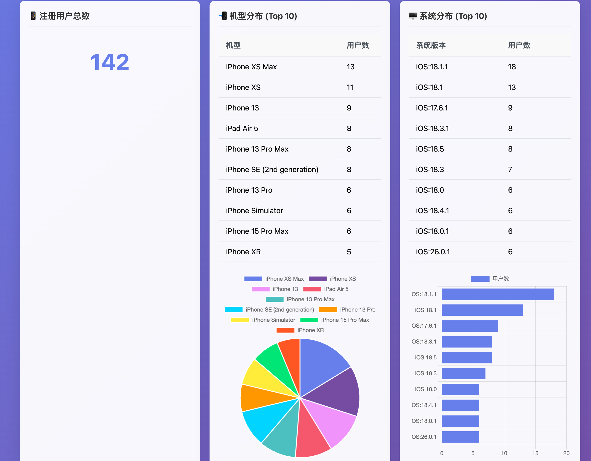

# 智能数据库看板生成器

> 用自然语言查询 MySQL 数据库，自动生成可视化 HTML 看板

[](LICENSE)
[](https://www.python.org/)
[](https://www.mysql.com/)
[](https://github.com/skyzizhu/smart-db-dashboard/releases)

---

## ✨ 特性

- 🗣️ **自然语言查询** - 用中文描述查询需求，系统自动生成 SQL
- 🎯 **智能表匹配** - 自动发现数据库表，智能匹配查询意图
- 📊 **自动可视化** - 根据数据类型自动生成图表（饼图、折线图等）
- 📄 **HTML 看板导出** - 生成独立的 HTML 文件，支持分页浏览
- ⚙️ **可配置化** - 支持自定义业务实体映射和查询模式
- 🚀 **通用适配** - 适配任何 MySQL 数据库结构
- 🔧 **灵活扩展** - 通过配置文件轻松适配您的业务

---

## 📸 看板预览



生成的看板包含：

- 📈 **统计卡片** - 总记录数、平均值、分类统计等
- 📊 **数据图表** - 饼图展示分布、折线图展示趋势
- 📋 **分页列表** - 支持翻页浏览所有数据
- 📱 **响应式设计** - 适配桌面、平板、手机

---

## 👥 适用人群

### 🎯 产品经理

这是一个专为产品经理设计的 **产品经理 Skill**，让你无需 SQL 知识也能轻松查看和分析用户数据：

**用户数据分析**
- 查看用户总数、注册量、活跃用户统计
- 分析用户增长趋势和留存情况
- 了解用户分布和用户画像

**业务数据监控**
- 实时查看核心业务指标（KPI）
- 监控功能使用情况和用户行为
- 分析销售数据和订单趋势

**快速决策支持**
- 无需等待数据报表，即时获取数据
- 自动生成可视化图表，直观展示数据
- 支持导出 HTML 看板，方便分享给团队

**使用场景示例**
```
产品经理: 查看最近一周的用户注册趋势
产品经理: 分析用户设备类型分布
产品经理: 统计本月新增用户数量
产品经理: 查看某个功能的使用情况
```

### 👨‍💻 数据分析师

快速探索数据库，生成临时报表和可视化图表

### 🛠️ 开发人员

调试数据问题，验证数据逻辑，快速生成测试数据看板

---

## 🔧 环境要求

### 必需软件

| 软件 | 版本要求 | 说明 |
|------|----------|------|
| **Python** | 3.7 或更高版本 | 核心运行环境 |
| **MySQL** | 5.7 或更高版本 | 数据库服务器 |
| **Claude Code** | 最新版本 | IDE集成支持（可选） |

### Python 依赖包

```bash
pip install mysql-connector-python
```

---

## 🚀 安装与配置（重点）

### 0. 在 Codex / 本地安装 skill

**方式 A：在 Codex 中一键安装（推荐）**

在 Codex 里直接说：

```text
帮我下载这个skill：https://github.com/skyzizhu/smart-db-dashboard
```

Codex 会自动克隆本仓库，你只需要在本地配置数据库和实体映射即可。

**方式 B：手动克隆仓库**

```bash
git clone https://github.com/skyzizhu/smart-db-dashboard.git
cd smart-db-dashboard
```

> 后面的所有命令默认都在 `smart-db-dashboard` 目录下执行。

---

### 1. 配置数据库连接（必配，最重要）

Skill 本身不带你的数据库信息，每个使用者必须按自己的环境配置 `db_config.json`：

1）复制模板：

```bash
cp db_config.json.template db_config.json
```

2）编辑 `db_config.json`，填上自己的 MySQL 连接信息：

```json
{
  "host": "your_database_host",
  "port": 3306,
  "user": "your_username",
  "password": "your_password",
  "database": "your_database_name",
  "charset": "utf8mb4"
}
```

- `host`：数据库地址（IP 或域名），例如 `127.0.0.1` / 内网 IP / 云数据库地址  
- `port`：MySQL 端口，默认 3306  
- `user` / `password`：有查询权限的账号和密码  
- `database`：要查询的数据库名  
- `charset`：建议固定使用 `utf8mb4`

3）完成后，可以用内置自检命令验证配置是否正确：

```bash
python scripts/smart_dashboard_generator.py --check-config
```

它会：
- 检查 `db_config.json` 字段是否完整、类型是否正确  
- 尝试连接你的数据库，并提示“连接成功 / 失败以及原因”

---

### 2. 配置业务实体映射（推荐，但不是强制）

`entity_config.json` 决定“你说的中文表述”如何映射到实际表名、时间字段等。  
不配置也能用（会自动通过 `SHOW TABLES` + 表名匹配），但配置后体验会好很多。

1）复制模板：

```bash
cp entity_config.json.template entity_config.json
```

2）编辑 `entity_config.json` 的三个核心部分：  

#### 2.1 `entity_mappings`：中文业务名 → 实际表名

示例：

```json
{
  "entity_mappings": {
    "用户相关": {
      "用户表": "your_user_table",
      "注册表": "your_user_table",
      "会员表": "your_user_table"
    },
    "订单相关": {
      "订单表": "your_order_table",
      "销售表": "your_order_table"
    },
    "启动相关": {
      "启动表": "your_launch_table",
      "启动信息表": "your_launch_table"
    },
    "使用相关": {
      "使用表": "your_usage_table",
      "功能使用表": "your_usage_table"
    }
  }
}
```

配置好以后：
- 你说“查询注册表最近7天的数据”，会自动映射到 `your_user_table`；  
- 你说“最近7天使用表的数据”，会映射到 `your_usage_table`。

#### 2.2 `time_field_mappings`：表名 → 时间字段

告诉系统每个表用哪个时间字段做“最近X天、本周、本月”等过滤：

```json
{
  "time_field_mappings": {
    "your_user_table": "created_at",
    "your_order_table": "order_time",
    "your_launch_table": "launch_time",
    "your_usage_table": "usage_time"
  }
}
```

这样：
- “最近7天注册表的数据” → 使用 `your_user_table.created_at` 做时间条件  
- “本周启动次数有多少” → 使用 `your_launch_table.launch_time` 做时间条件。

#### 2.3 `table_aliases`（可选）：英文别名 → 实际表名

如果你习惯在查询里用简写，比如 `users / orders / launch`，可以配置：

```json
{
  "table_aliases": {
    "users": "your_user_table",
    "orders": "your_order_table",
    "launch": "your_launch_table",
    "usage": "your_usage_table"
  }
}
```

> 完整字段说明和高级配置请参考 [CONFIG_GUIDE.md](CONFIG_GUIDE.md)。

---

### 3. 在 Codex / 命令行中使用 skill

**在 Codex 对话里：**

- 先确保当前工作区指向这个仓库；
- 然后直接用自然语言提问，例如：

```text
用 smart-db-dashboard 查询最近7天使用表的数据，并生成 HTML 看板
用 smart-db-dashboard 帮我生成“本周注册表的用户数量有多少”的 SQL
```

**在命令行里：**

只看 SQL（不生成 HTML）：

```bash
python scripts/smart_dashboard_generator.py --mode sql "本周注册表的用户数量有多少"
```

查数据并按需生成 HTML 看板：

```bash
python scripts/smart_dashboard_generator.py "最近7天使用表的数据"
# 程序会先打印匹配表+SQL+行数，再询问是否生成 HTML 文件
```

---

## 💡 自然语言查询示例

### 统计查询

```
用户: 查询用户表有多少人
用户: 今天的注册量是多少
用户: 订单表的平均销售额
```

### 时间范围查询

```
用户: 最近7天的用户注册量
用户: 使用表最近3天的数据
用户: 订单表本月的销售总额
```

### 列表查询

```
用户: 显示用户表最新的100条记录
用户: 查看订单表的销售详情
```

### 统计类查询（更贴近期望）

```
用户: 本周启动次数有多少
用户: 本月注册用户有多少个
用户: 最近7天每个功能的使用次数
```

你也可以只生成 SQL：

```bash
python scripts/smart_dashboard_generator.py --mode sql "本周启动次数有多少"
```

### 多表联查思路（当前简版）

当前版本会优先识别主表，并给出「相关表列表」，JOIN 规则可以在
`scripts/nlp_query_parser.py` 中的 `_plan_joins` / `_generate_sql` 里按你的外键关系继续扩展。

典型多表场景示例：

- 查询每个渠道来源的注册用户数量
- 最近30天，每个来源渠道的启动次数

---

## 📂 项目结构

```
smart-db-dashboard/
├── assets/                           # 前端资源
│   ├── enhanced_dashboard_template.html  # 增强看板模板
│   └── dashboard.js                  # 交互脚本
├── scripts/                          # 核心脚本
│   ├── smart_db_connector.py        # 数据库连接器
│   ├── nlp_query_parser.py          # NLP 解析器
│   └── smart_dashboard_generator.py  # 看板生成器
├── entity_config.json                # 业务实体配置
├── db_config.json.template          # 数据库配置模板
├── CONFIG_GUIDE.md                  # 配置指南
├── README.md                        # 项目说明
├── SKILL.md                         # Skill 文档
└── LICENSE                          # 开源协议
```

---

## 📖 配置说明

### 业务实体映射

将用户友好的业务名称映射到实际数据库表名：

```json
{
  "entity_mappings": {
    "用户相关": {
      "用户表": "tb_users",
      "注册表": "tb_users",
      "会员表": "tb_users"
    },
    "订单相关": {
      "订单表": "tb_orders",
      "销售表": "tb_orders"
    }
  }
}
```

### 时间字段映射

指定每个表应该使用的时间字段：

```json
{
  "time_field_mappings": {
    "tb_users": "created_at",
    "tb_orders": "order_time"
  }
}
```

**详细配置请参考 [CONFIG_GUIDE.md](CONFIG_GUIDE.md)**

---

## 🎯 支持的查询模式

| 类型 | 示例 |
|------|------|
| 统计 | "用户表有多少人"、"订单表总数" |
| 时间范围 | "最近7天"、"本月"、"最近3个月" |
| 列表 | "显示最新的100条用户" |
| 趋势 | "最近一周的注册趋势" |

---

## 🎨 生成的看板功能

| 功能 | 说明 |
|------|------|
| **统计卡片** | 总记录数、平均值、分类数等 |
| **饼图** | 分类数据分布（如设备类型） |
| **折线图** | 时间趋势分析 |
| **分页列表** | 每页 20 条，支持翻页 |
| **自动刷新** | macOS 系统自动在浏览器打开 |

---

## 🔧 技术栈

- **Python 3.7+** - 核心逻辑
- **MySQL 5.7+** - 数据库支持
- **Chart.js 4.4** - 图表库
- **JavaScript ES6** - 前端交互

---

## 📋 版本历史

### v3.0 (2025-01-21)
- ✨ 新增自动 HTML 看板生成
- ✨ 新增数据图表（饼图、折线图）
- ✨ 新增统计卡片
- ✨ 新增分页列表功能
- ✨ 新增唯一文件命名
- ✨ 新增自动浏览器预览

### v2.0 (2025-01-20)
- ✨ 业务实体映射
- ✨ 灵活时间范围
- ✨ 可配置化支持

### v1.0 (2025-01-19)
- ✨ 初始版本
- ✨ 自然语言查询
- ✨ 智能表匹配

---

## 🤝 贡献

欢迎提交 Issue 和 Pull Request！

---

## 📄 开源协议

MIT License - 详见 [LICENSE](LICENSE) 文件

---

## 📞 联系方式

- **Issues**: [GitHub Issues](https://github.com/skyzizhu/smart-db-dashboard/issues)
- **Discussions**: [GitHub Discussions](https://github.com/skyzizhu/smart-db-dashboard/discussions)

---

## ⭐ Star History

如果这个项目对你有帮助，请给个 Star 支持！

---

**Made with ❤️ by Smart Dashboard Team**
